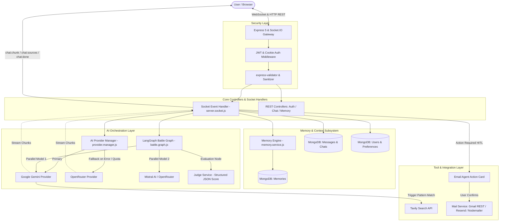
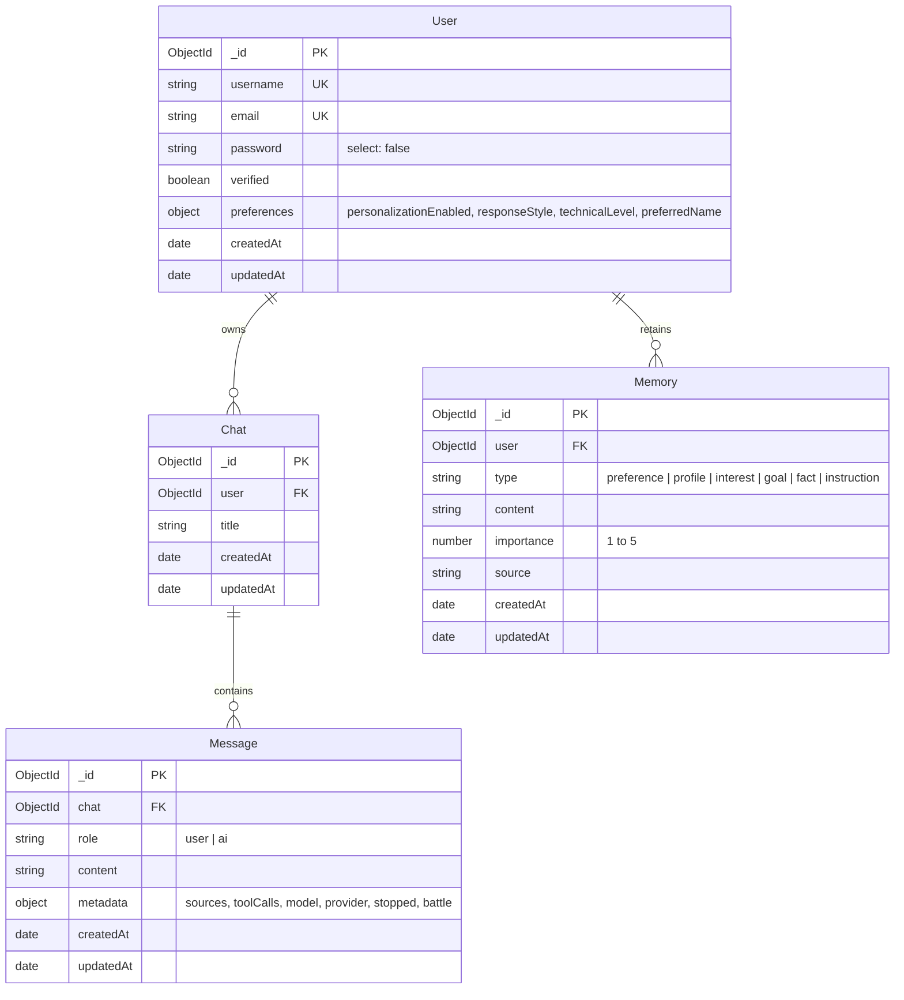

# QueryMind — AI-Powered Context-Aware Research Assistant

[](https://querymind-aeh7.onrender.com)
[](https://github.com/naitik-work/QueryMind)
[](https://react.dev/)
[](https://nodejs.org/)
[](https://expressjs.com/)
[](https://www.mongodb.com/)
[](https://socket.io/)
[](LICENSE)

QueryMind is an intelligent full-stack research assistant and conversational AI platform built with React 19, Node.js, Express, Socket.IO, and MongoDB. It bridges the gap between real-time internet search, durable cross-session personalization, and multi-model evaluation through automated resilience fallbacks and LangGraph-powered AI battle graphs.

🔗 **Live Demo:** [https://querymind-aeh7.onrender.com](https://querymind-aeh7.onrender.com)

---

## Table of Contents

- [Overview](#overview)
- [Key Features](#key-features)
- [Screenshots / Demo](#screenshots--demo)
- [Tech Stack](#tech-stack)
- [System Architecture](#system-architecture)
- [How QueryMind Works](#how-querymind-works)
- [Project Structure](#project-structure)
- [Getting Started](#getting-started)
- [Environment Variables](#environment-variables)
- [Running Locally](#running-locally)
- [API Documentation](#api-documentation)
- [Socket.IO Events](#socketio-events)
- [Authentication & Security](#authentication--security)
- [Database Design](#database-design)
- [AI & Research Pipeline](#ai--research-pipeline)
- [Deployment](#deployment)
- [Engineering Highlights](#engineering-highlights)
- [Challenges & Solutions](#challenges--solutions)
- [Future Improvements](#future-improvements)
- [Takeaways](#takeaways)
- [Author](#author)

---

## Overview

Most traditional conversational interfaces operate as stateless wrappers around single LLM endpoints. They suffer from three core limitations:

1. **Context Amnesia:** Every new conversation starts from an empty slate, forgetting user identity, project constraints, technical depth preferences, and historical facts.
2. **Provider Fragility:** If an upstream model experiences rate limits (HTTP 429), quota exhaustion, or service degradation (HTTP 503), the entire client session halts.
3. **Information Lag & Hallucinations:** Large language models without web grounding cannot verify current facts, verify documentation, or cite verified web sources.

**QueryMind solves these problems directly:**
- **Persistent Personal Memory Layer:** Automatically detects, classifies, scores, and stores durable facts (user preferences, skills, technical level, and project details) across conversations without bloating token budgets.
- **Resilient Multi-Provider Orchestration:** Intelligently routes requests through primary providers (Google Gemini) and automatically cascades to fallback providers (OpenRouter) upon detecting rate limits or runtime failures.
- **Real-Time Web Grounding:** Dynamically identifies queries requiring real-time facts, executes live web queries via Tavily Search, and formats citations with explicit source domain attribution.
- **AI Battle Arena:** Uses a compiled LangGraph state graph to invoke competing models concurrently and evaluate the answers through an impartial, structured LLM-as-a-Judge scoring engine.
- **Human-in-the-Loop (HITL) Tooling:** Separates read-only actions from sensitive operations (such as drafting and sending emails via Gmail REST API or Nodemailer), requiring explicit UI action cards before execution.

---

## Key Features

- **Real-Time Token Streaming:** Bi-directional token streaming powered by Socket.IO with instantaneous chunk rendering, status indicators, and client-side abort controls.
- **Durable Memory & Personalization:** Automatic extraction of user facts (importance ratings 1–5, categorized by preference, profile, goal, interest, and instructions) injected dynamically into system context.
- **Multi-Provider AI Fallback:** Automated fallback failover between Google Gemini and OpenRouter if upstream rate limits, quota limits, or network timeouts occur.
- **AI Battle Arena (LangGraph):** Dual-model parallel inference orchestrator with an impartial LLM judge evaluating correctness, clarity, completeness, and reasoning with 0–10 scoring.
- **Live Internet Research (Tavily):** Automatic trigger detection for queries requiring recent information, querying the live web, and providing structured citations with title, domain, URL, and snippets.
- **Human-in-the-Loop Email Agent:** Interactive email draft action cards allowing users to review, edit parameters, and confirm outgoing emails with CRLF injection sanitization.
- **Multi-Transport Email Delivery:** Resilient triple-layer delivery utilizing Gmail REST API (OAuth2 over HTTPS Port 443 to bypass cloud SMTP port blocking), Resend API, and Nodemailer SMTP.
- **Secure Authentication:** JWT-based authentication using HTTP-only cookies, password hashing with bcryptjs (10 salt rounds), and email verification links.
- **User Preference Configuration:** User-level configuration for response style (`concise`, `balanced`, `detailed`), technical level (`beginner`, `intermediate`, `advanced`), preferred name, and personalization toggles.
- **Rich Markdown & Code Rendering:** Clean code presentation with syntax-highlighted code blocks, copy-to-clipboard actions, inline links, and source accordions.
- **Conversation Management:** AI-generated conversation titles based on initial intent, conversation history retrieval, renaming, and soft/hard deletion.

---

## Screenshots / Demo

*Screenshots coming soon.*

Experience the live application here:
🔗 **[https://querymind-aeh7.onrender.com](https://querymind-aeh7.onrender.com)**

---

## Tech Stack

| Category | Technology | Description |
| :--- | :--- | :--- |
| **Frontend** | React 19 | Client-side reactive interface |
| **State Management** | Redux Toolkit | Centralized state management for auth, chat, and memories |
| **Build & Tooling** | Vite 8 | Fast frontend build tool and dev server |
| **Styling** | Tailwind CSS v4 | Modern utility-first CSS design system |
| **Markdown** | React Markdown | Markdown parsing with custom code block components |
| **Routing** | React Router v8 | Single-page application client-side routing |
| **Backend** | Node.js (ES Modules) | Asynchronous backend JavaScript runtime |
| **Web Framework** | Express 5 | RESTful API routing, error handling, and middleware |
| **Real-Time Communication** | Socket.IO (v4.8) | Bi-directional WebSocket communication and streaming |
| **Database** | MongoDB | Document-oriented NoSQL database |
| **ODM** | Mongoose (v9.9) | Schema validation, indexing, and query modeling |
| **AI Framework** | LangChain (`@langchain/core`) | Message abstractions, system prompt synthesis, and chains |
| **AI Orchestration** | LangGraph (`@langchain/langgraph`) | State graph orchestration for parallel battle arena nodes |
| **Primary AI Model** | Google Gemini (`@langchain/google-genai`) | Primary generative reasoning and streaming model |
| **Fallback AI Model** | OpenRouter (`openrouter.ai`) | Secondary fallback provider for zero-downtime redundancy |
| **Third Model** | Mistral AI (`@langchain/mistralai`) | Alternative battle model provider |
| **Web Retrieval** | Tavily Search (`@tavily/core`) | Web search API returning structured results and snippets |
| **Authentication** | JSON Web Tokens (`jsonwebtoken`) & `bcryptjs` | Stateless session tokens and salted password hashing |
| **Email Services** | Nodemailer & Gmail REST API | Multi-transport transactional emails and email agent |
| **Validation** | `express-validator` | Request payload sanitization and constraint checking |
| **Deployment** | Render | Production hosting for web service and client |

---

## System Architecture



---

## How QueryMind Works

### 1. Connection & Session Hydration
1. When a user logs in, the server generates a signed JSON Web Token (JWT) set as an `HTTP-only` cookie.
2. The client opens a persistent Socket.IO connection. The socket middleware validates the handshake cookie against `JWT_SECRET`, extracting `socket.user` without exposing tokens to JavaScript.

### 2. Query Dispatch & Intent Detection
1. The user enters a prompt. If the user starts a fresh thread, the backend calls `generateChatTitle()` (powered by lightweight LLM completion with fallback truncation) and persists the chat container.
2. The user message is immediately saved to the `Message` collection in MongoDB.
3. The prompt is inspected for specific intents:
   - **Battle Mode Flag:** Activates the dual-model comparison graph.
   - **Internet Search Need:** Trigger pattern heuristics detect temporal or factual inquiries (e.g., "latest", "recent updates", "who won", "current price").
   - **Email Agent Intent:** Detects email drafting patterns (e.g., "send email to", "draft a mail"), automatically creating a pending sensitive action ID.

### 3. Context & Durable Memory Synthesis
1. The system loads recent conversation history (up to 25–30 messages) from MongoDB.
2. If personalization is enabled, the system queries high-importance memories and preferences (`preferredName`, `technicalLevel`, `responseStyle`) associated with the user ID.
3. The context is synthesized into a system prompt enforcing factual accuracy, markdown structure, and strict prohibition against disclosing internal tokens or API keys.

### 4. Real-Time Streaming & Resilience Failover
1. The `AIProviderManager` initiates an asynchronous stream generator with Google Gemini.
2. If internet search was flagged, Tavily executes, yields a `sources` event to the client, and incorporates the formatted snippets into the LLM context.
3. Tokens are streamed to the frontend via `chat:chunk` events.
4. **Automated Fallback:** If the primary provider triggers a retryable error (HTTP 429 quota exhaustion, 503 unavailable, or network timeout) before tokens are emitted to the client, the provider manager switches to the secondary provider (OpenRouter) seamlessly.

### 5. Sensitive Tool Execution (Human-in-the-Loop)
1. If an email request is detected, the server emits a `chat:action_required` event containing the parsed recipient, subject, and body draft.
2. An interactive action card appears on the user interface. The user can edit the fields or click **Confirm & Send**.
3. Upon receiving the `action:confirm` event, the backend validates recipient syntax, strips dangerous CRLF control characters to prevent header injection, and dispatches the email via the Gmail REST API (over HTTPS Port 443).

### 6. Persistence & Asynchronous Memory Extraction
1. Upon stream completion, the full response, model name, provider, and source citations are saved to MongoDB as an `ai` message.
2. In the background, `detectAndStoreDurableMemory()` analyzes the user message for memorable facts, preferences, or self-descriptions, storing them with importance scores for subsequent chats.

---

## Project Structure

```
QueryMind/
├── backend/
│   ├── server.js                     # HTTP server bootstrap & Socket.IO initialization
│   ├── package.json                  # Backend dependencies, scripts, and module configs
│   ├── .env.example                  # Backend environment variable template
│   └── src/
│       ├── app.js                    # Express app initialization, CORS, middleware, routes
│       ├── config/
│       │   └── database.js           # Mongoose connection with retry handling
│       ├── controllers/
│       │   ├── auth.controller.js    # Register, login, logout, getMe, email verification
│       │   ├── chat.controller.js    # REST endpoints for chats, messages, deletion, rename
│       │   └── memory.controller.js  # CRUD endpoints for memories and user preferences
│       ├── middlewares/
│       │   └── auth.middlewares.js   # JWT verification middleware for Express routes
│       ├── models/
│       │   ├── chat.model.js         # Chat conversation schema & compound indexes
│       │   ├── memory.model.js       # User durable memory schema with importance ratings
│       │   ├── message.model.js      # Message schema supporting sources, tools, and battle data
│       │   └── user.model.js         # User account schema, bcrypt hashing, preferences
│       ├── routes/
│       │   ├── auth.routes.js        # Auth endpoint definitions
│       │   ├── chat.routes.js        # Chat resource routes
│       │   └── memory.routes.js      # Memory and preference routes
│       ├── services/
│       │   ├── ai.service.js         # AI generation, title synthesis, and stream delegation
│       │   ├── battle.service.js     # Model invocation wrappers for the Battle Arena
│       │   ├── internet.service.js   # Tavily Web Search integration and snippet parser
│       │   ├── mail.service.js       # Triple-layer email dispatcher (Gmail API / Resend / Nodemailer)
│       │   ├── memory.service.js     # Legacy memory utility methods
│       │   └── ai/
│       │       ├── battle.graph.js   # LangGraph StateGraph definition for dual-model evaluation
│       │       ├── gemini.provider.js # Google Gemini streaming provider & tool detectors
│       │       ├── judge.service.js  # LLM-as-a-Judge schema prompt & JSON parser
│       │       ├── memory.service.js # Durable memory extraction patterns & context formatting
│       │       ├── openrouter.provider.js # OpenRouter streaming fallback provider
│       │       ├── provider.manager.js # Resilient multi-provider failover manager
│       │       └── tool.service.js   # Tool categorization (READ_ONLY vs SENSITIVE) & executor
│       ├── sockets/
│       │   └── server.socket.js      # Socket.IO connection handling, streaming, stop & HITL
│       └── validator/
│           └── auth.validation.js    # express-validator rules for registration and login
│
├── frontend/
│   ├── index.html                    # Single-page application entry point
│   ├── vite.config.js                # Vite build configuration with React & Tailwind plugins
│   ├── package.json                  # Frontend dependencies and build scripts
│   ├── .env.example                  # Frontend environment variable template
│   └── src/
│       ├── main.jsx                  # React DOM mount with Redux Provider
│       ├── app/
│       │   ├── App.jsx               # Application root, auth verification lifecycle
│       │   ├── app.routes.jsx        # Route definitions (/login, /register, /verify-email, /)
│       │   ├── app.store.js          # Redux Toolkit store (auth, chat, memory slices)
│       │   └── index.css             # Tailwind v4 directives and design tokens
│       └── features/
│           ├── auth/
│           │   ├── auth.slice.js     # Redux slice for authentication state
│           │   ├── components/
│           │   │   └── Protected.jsx # Route authentication guard
│           │   ├── hook/
│           │   │   └── useAuth.js    # Custom hook for auth operations
│           │   ├── pages/
│           │   │   ├── Login.jsx     # User login screen
│           │   │   ├── Register.jsx  # Registration form with email verification feedback
│           │   │   └── VerifyEmail.jsx # Email verification callback handler
│           │   └── services/
│           │       └── auth.api.js   # Axios client for auth endpoints
│           ├── chat/
│           │   ├── chat.slice.js     # Redux slice for active conversation, messages, streaming
│           │   ├── components/
│           │   │   ├── ChatArea.jsx  # Message viewport, empty states, and action cards
│           │   │   ├── ChatComposer.jsx # Text input with multi-line auto-expand
│           │   │   ├── Composer.jsx  # Action bar with Battle Mode toggle and web search
│           │   │   ├── MessageList.jsx # Scrollable conversation container
│           │   │   ├── SettingsModal.jsx # Personalization and model preference modal
│           │   │   ├── Sidebar.jsx   # Thread history, search, new chat, and user menu
│           │   │   ├── battle/       # Battle Arena comparison cards, scoring & judge output
│           │   │   └── chat/         # Message items, syntax-highlighted code blocks, sources
│           │   ├── hooks/
│           │   │   └── useChat.js    # Custom hook interfacing with Socket.IO and REST API
│           │   ├── pages/
│           │   │   └── Dashboard.jsx # Primary application workspace
│           │   └── service/
│           │       ├── chat.api.js   # REST API client for conversations
│           │       └── chat.socket.js # Singleton Socket.IO client instance
│           └── memory/
│               ├── MemoryPanel.jsx   # Memory manager drawer to inspect and delete memories
│               ├── memory.api.js     # Axios client for memory management
│               ├── memory.slice.js   # Redux slice for durable memory list
│               └── useMemory.js      # Custom hook for memory management
│
└── docs/
    └── QUERMIND_ARCHITECTURE.md     # In-depth architectural specification and deep-dive
```

---

## Getting Started

### Prerequisites

Make sure the following are installed on your workstation:
- **Node.js**: v18.0.0 or higher (v20+ recommended)
- **npm**: v9.0.0 or higher
- **MongoDB**: Local MongoDB instance (v6.0+) or a free [MongoDB Atlas](https://www.mongodb.com/atlas) cluster URI
- **API Keys**:
  - [Google AI Studio Key](https://aistudio.google.com/) for Gemini models
  - [OpenRouter API Key](https://openrouter.ai/) for fallback support
  - [Tavily Search API Key](https://tavily.com/) for internet-grounded search
  - *(Optional)* Gmail OAuth2 credentials or [Resend API Key](https://resend.com/) for email delivery

### Clone Repository

```bash
git clone https://github.com/naitik-work/QueryMind.git
cd QueryMind
```

### Install Dependencies

Install the backend and frontend dependencies in their respective folders:

```bash
# 1. Install Backend Dependencies
cd backend
npm install

# 2. Install Frontend Dependencies
cd ../frontend
npm install
```

---

## Environment Variables

### Backend Configuration

Create a `.env` file in the `backend/` directory:

```bash
# backend/.env

# Server & Network
PORT=3000
NODE_ENV=development
FRONTEND_URL=http://localhost:5173
BACKEND_URL=http://localhost:3000

# Database & Security
MONGO_URI=your_mongodb_connection_string
JWT_SECRET=your_super_secret_jwt_key_here

# Primary AI Provider (Google Gemini)
PRIMARY_AI_PROVIDER=gemini
PRIMARY_AI_MODEL=gemini-2.0-flash
GEMINI_API_KEY=your_google_gemini_api_key

# Fallback AI Provider (OpenRouter)
FALLBACK_AI_PROVIDER=openrouter
FALLBACK_AI_MODEL=google/gemini-2.0-flash-exp:free
OPEN_ROUTER_API_KEY=your_openrouter_api_key

# Web Search Provider (Tavily)
TAVILY_API_KEY=your_tavily_search_api_key

# Email Delivery: Google OAuth2 / Gmail REST API
GOOGLE_USER=your_verified_gmail_account@gmail.com
GOOGLE_CLIENT_ID=your_google_cloud_oauth_client_id
GOOGLE_CLIENT_SECRET=your_google_cloud_oauth_client_secret
GOOGLE_REFRESH_TOKEN=your_google_oauth_refresh_token

# Alternative Email Delivery: Resend (Optional)
RESEND_API_KEY=your_resend_api_key
RESEND_FROM=QueryMind <onboarding@resend.dev>

# AI Battle Arena Evaluation (Optional overrides)
BATTLE_JUDGE_PROVIDER=gemini
BATTLE_JUDGE_MODEL=gemini-2.0-flash
MISTRAL_API_KEY=your_mistral_api_key_if_using_mistral
```

### Frontend Configuration

Create a `.env` file in the `frontend/` directory:

```bash
# frontend/.env
VITE_API_URL=http://localhost:3000
```

> [!WARNING]
> Never commit actual `.env` files with secret keys to version control. Both subdirectories include `.gitignore` rules preventing `.env` leaks.

---

## Running Locally

Run the backend and frontend in separate terminal windows:

### Terminal 1: Backend Server

```bash
cd backend
npm run dev
```
*The Express and Socket.IO server will start at:* **`http://localhost:3000`**

### Terminal 2: Frontend Client

```bash
cd frontend
npm run dev
```
*The Vite development server will start at:* **`http://localhost:5173`**

Open **`http://localhost:5173`** in your browser to access QueryMind.

---

## API Documentation

### REST API Endpoints

All authenticated endpoints require a valid JWT token passed either via the `token` HTTP-only cookie or as an `Authorization: Bearer <token>` header.

#### 1. Authentication (`/api/auth`)

| Method | Endpoint | Description | Auth Required |
| :--- | :--- | :--- | :---: |
| `POST` | `/api/auth/register` | Register a new user and dispatch a verification email | No |
| `POST` | `/api/auth/login` | Validate credentials and set the JWT HTTP-only cookie | No |
| `POST` | `/api/auth/logout` | Clear the auth cookie and terminate the session | No |
| `GET` | `/api/auth/get-me` | Retrieve the authenticated user profile and preferences | **Yes** |
| `GET` | `/api/auth/verify-email` | Validate email verification token from URL query string | No |

#### 2. Chat & Messages (`/api/chats` or `/api/chat`)

| Method | Endpoint | Description | Auth Required |
| :--- | :--- | :--- | :---: |
| `POST` | `/api/chats/message` | Send message over REST (alternative to WebSocket) | **Yes** |
| `GET` | `/api/chats` | Retrieve all conversation threads for the user | **Yes** |
| `GET` | `/api/chats/:chatId/messages` | Retrieve chronological message history for a conversation | **Yes** |
| `PATCH` | `/api/chats/:chatId` | Rename a conversation title | **Yes** |
| `DELETE` | `/api/chats/:chatId` | Delete a conversation and all its messages | **Yes** |

#### 3. Memory & User Preferences (`/api`)

| Method | Endpoint | Description | Auth Required |
| :--- | :--- | :--- | :---: |
| `GET` | `/api/memory` | Retrieve all durable memories associated with the user | **Yes** |
| `POST` | `/api/memory` | Manually create a new memory entity | **Yes** |
| `PATCH` | `/api/memory/:id` | Update an existing memory's content, type, or importance | **Yes** |
| `DELETE` | `/api/memory/:id` | Delete a specific durable memory by ID | **Yes** |
| `GET` | `/api/user/preferences` | Retrieve user response preferences and personalization settings | **Yes** |
| `PATCH` | `/api/user/preferences` | Update style, technical level, preferred name, or personalization toggle | **Yes** |

#### 4. Health & System

| Method | Endpoint | Description | Auth Required |
| :--- | :--- | :--- | :---: |
| `GET` | `/` | Service health check returning API name, version, and status | No |

---

## Socket.IO Events

Real-time interactions are managed by the Socket.IO server on the same HTTP port.

### Client-to-Server Events

| Event | Payload | Description |
| :--- | :--- | :--- |
| `chat:send` | `{ message, chatId, battleMode }` | Send a user message to trigger token streaming or the battle graph |
| `chat:stop` | `{ chatId, partialContent }` | Abort an ongoing generation stream; saves partial response |
| `action:confirm` | `{ actionId, approved, parameters }` | Confirm or reject a sensitive tool action (e.g., sending an email) |

### Server-to-Client Events

| Event | Payload | Description |
| :--- | :--- | :--- |
| `chat:created` | `{ chat: { id, title, updatedAt } }` | Emitted when a new conversation thread is provisioned |
| `chat:message_saved` | `{ chatId, message: { id, content, role } }` | Confirms user message persistence in MongoDB |
| `chat:status` | `{ chatId, status, label }` | Real-time status update (`thinking`, `searching`, `generating`, `reading`) |
| `chat:sources` | `{ chatId, sources: [...] }` | Emits web search citations (title, URL, domain, snippet) |
| `chat:chunk` | `{ chatId, chunk }` | Individual token chunk for real-time text streaming |
| `chat:done` | `{ chatId, message }` | Signals stream completion and provides the final persisted message object |
| `chat:stopped` | `{ chatId, message }` | Confirms stream cancellation following a `chat:stop` signal |
| `chat:action_required` | `{ actionId, chatId, tool, details }` | Requests explicit user confirmation for sensitive tool execution |
| `chat:error` | `{ chatId, message, code }` | Returns a structured error message if generation fails |
| `action:completed` | `{ actionId, chatId, message }` | Confirms successful execution of a sensitive action |
| `action:cancelled` | `{ actionId, chatId }` | Confirms cancellation of a sensitive action |
| `action:error` | `{ actionId, chatId, message }` | Emitted when an action execution errors out |

---

## Authentication & Security

- **Stateless JWT with Dual Transport:** Authentication tokens are signed using a secret key with a 7-day expiration. The token is transported primarily via an `HTTP-only`, `SameSite` cookie to mitigate Cross-Site Scripting (XSS) token theft. The socket connection verifies the cookie directly during the handshake.
- **Salted Password Encryption:** Passwords are hashed using `bcryptjs` with 10 salt rounds inside a Mongoose `pre('save')` hook. Passwords are set with `select: false` on the user schema to prevent accidental leaks in database queries.
- **Email Verification Flow:** Newly registered users are created with `verified: false`. A time-bound verification token (24-hour expiration) is generated and delivered through a transactional email link.
- **Header Injection & Parameter Sanitization:** The sensitive email agent sanitizes recipient addresses and subject headers by stripping Carriage Return and Line Feed characters (`\r`, `\n`), neutralizing CRLF email header injection vulnerabilities.
- **CORS Whitelisting:** Strict cross-origin resource sharing policies allow only configured origins (e.g., local Vite dev ports and production frontend domains) with credentials enabled.
- **No Secret Exposure:** Server environment variables are isolated from client bundles. Front-facing errors are sanitized to prevent leaking stack traces in production environments.

---

## Database Design

QueryMind uses MongoDB with Mongoose schemas designed for performance, fast indexing, and flexible metadata storage.



### Models & Collections

| Model | Collection | Primary Responsibility | Key Indexes |
| :--- | :--- | :--- | :--- |
| **`User`** | `users` | Stores credentials, email verification status, and personalization settings | `{ email: 1 }` (unique), `{ username: 1 }` (unique) |
| **`Chat`** | `chats` | Stores conversation containers and AI-synthesized titles | `{ user: 1, updatedAt: -1 }` |
| **`Message`** | `messages` | Stores individual message turns, web citations, tool execution results, and battle records | `{ chat: 1, createdAt: 1 }` |
| **`Memory`** | `memories` | Stores durable personal facts, skills, and instructions extracted from user messages | `{ user: 1, importance: -1, createdAt: -1 }` |

---

## AI & Research Pipeline

The AI engine combines multi-model resilience, dynamic context synthesis, live internet retrieval, and competitive evaluation:

### 1. Resilient Multi-Provider Strategy
Large language model APIs occasionally hit quota limits or service degradations. QueryMind's `AIProviderManager` implements an automated fallback state machine:
- **Primary:** Google Gemini (via `ChatGoogleGenerativeAI`).
- **Fallback:** OpenRouter (direct REST streaming endpoint utilizing candidate models such as `gemini-2.0-flash-exp:free`).
- **Error Classifier:** `isRetryableAIError()` detects HTTP 404, 429, 500, 502, 503, rate limit strings, and socket timeouts. If the primary stream fails before emitting data, the provider manager falls back to OpenRouter without interrupting the user.

### 2. Live Internet Grounding (Tavily)
- User messages are evaluated against regular expression heuristics checking for queries needing real-time updates (e.g., current news, sports scores, release versions, recent events).
- When triggered, `searchInternet()` executes via `@tavily/core` with `searchDepth: "basic"`.
- Results are parsed into structured citations (title, URL, domain, snippet). Citations are streamed to the frontend and injected as a structured context block into the prompt before generation begins.

### 3. AI Battle Arena & LLM-as-a-Judge (LangGraph)
When a user enables **Battle Mode**:
1. A compiled **LangGraph** (`battle.graph.js`) executes two distinct models concurrently via `Promise.allSettled`.
2. The responses are routed into a second graph node: `judge_responses`.
3. An impartial judge model evaluates both outputs based on six objective criteria:
   - Factual correctness and absence of hallucinations
   - Query relevance and directness
   - Completeness and depth
   - Technical accuracy and code syntax
   - Structural clarity and formatting
   - Quality of reasoning and examples
4. The judge returns a strictly validated JSON payload containing scores (0–10), strengths, weaknesses, and a decisive winner verdict (`response1`, `response2`, or `tie`).

### 4. Durable Memory Extraction
- Personalization is kept distinct from chat history. Instead of re-submitting massive historical chat logs that consume token limits, the system runs `detectAndStoreDurableMemory()` in the background.
- Deterministic extraction patterns identify user declarations (names, language preferences, framework targets, learning goals) and store them with an importance score (1–5).
- Future chats hydrate these memories into a compact `[USER PERSONALIZATION & PERSISTENT MEMORY]` prompt block, allowing the assistant to remember the user's name and preferences across completely different conversations.

---

## Deployment

QueryMind is configured for production deployment on [Render](https://render.com).

🔗 **Live Production URL:** [https://querymind-aeh7.onrender.com](https://querymind-aeh7.onrender.com)

### Deployment Architecture
- **Single-Host Service:** Express serves the REST API endpoints and Socket.IO on port 3000 (or `process.env.PORT`).
- **Static Asset Serving:** The Vite client bundle (`dist/`) can be served directly through Express or hosted as an independent Static Site on Render communicating with the backend web service.
- **Port 443 HTTPS Email Transport:** Cloud platforms (including Render's Free tier) block outbound SMTP ports (25, 465, and 587) by default to prevent spam. QueryMind overcomes this restriction by sending emails over **HTTPS Port 443** via the Gmail REST API (using Google OAuth2 refresh tokens) and Resend API.

---

## Engineering Highlights

- **Resilient Dual-Provider Fallback Architecture:** Implemented a provider manager that monitors provider health and switches from Google Gemini to OpenRouter upon detecting HTTP 429 quota exhaustion or API failure.
- **LangGraph Multi-Model Battle Arena:** Created a parallel multi-model execution graph using `@langchain/langgraph` paired with an automated LLM-as-a-Judge system that outputs structured JSON evaluations.
- **Cloud Firewall-Proof Email Transport:** Engineered a custom email dispatcher that uses OAuth2 refresh tokens to interact directly with the Gmail REST API over HTTPS port 443, bypassing cloud-provider SMTP port blocks.
- **Human-in-the-Loop Sensitive Tool Execution:** Architected a security model differentiating read-only tools from sensitive side-effect tools, requiring explicit interactive client confirmation before executing real-world actions.
- **Decoupled Durable Memory Pipeline:** Separated chat history from durable memory facts, allowing long-term personalization across conversation windows without token bloat or context window degradation.
- **Real-Time Token Streaming with Abort Lifecycle:** Combined Socket.IO bi-directional streaming with JavaScript `AbortController` handles, allowing users to stop in-flight AI generations on demand and persist partial outputs cleanly.

---

## Challenges & Solutions

### 1. Outbound Cloud SMTP Port Blocking
- **Problem:** When deploying the email verification and email agent features to Render, all outbound TCP connections to SMTP ports 25, 465, and 587 timed out because Render blocks direct SMTP on free tier instances.
- **Solution:** Re-engineered `mail.service.js` with a multi-tier transport architecture. Before attempting SMTP, it attempts delivery via the Gmail REST API over HTTPS (Port 443) using OAuth2 tokens, with an additional fallback to the Resend API.

### 2. Upstream AI Rate Limits & Service Availability
- **Problem:** AI providers occasionally return HTTP 429 (Too Many Requests) or experience temporary downtime during peak usage, breaking chat sessions.
- **Solution:** Designed `AIProviderManager` with an intelligent error classifier (`isRetryableAIError`). If the primary model fails before emitting data, the system falls back to OpenRouter, ensuring high availability.

### 3. Dual-Model State Synchronization & Evaluation
- **Problem:** Running two competing LLMs simultaneously often leads to race conditions, unhandled rejections if one model fails, and inconsistent judging format.
- **Solution:** Built the Battle Arena using a compiled `LangGraph` state graph. The `generate_responses` node handles concurrency safely using `Promise.allSettled`, while the `judge_responses` node enforces a strict JSON schema for scoring.

### 4. Preventing Accidental Tool Side Effects
- **Problem:** Autonomous AI tool use can cause unintended side effects (such as sending premature or inaccurate emails without user consent).
- **Solution:** Implemented a Human-in-the-Loop protocol in `tool.service.js` and `server.socket.js`. The system parses parameters and issues an action card with an `actionId` to the frontend, requiring explicit user approval before execution.

---

## Future Improvements

- [ ] **Hybrid Vector Search Memory:** Integrate vector embeddings (e.g., Pinecone or MongoDB Atlas Vector Search) for semantic similarity retrieval of historical memories.
- [ ] **Conversation Export:** Enable one-click export of research conversations to Markdown, PDF, or structured JSON.
- [ ] **Granular Tool Sandboxing:** Add agentic code execution in sandboxed environments for data analysis and chart generation.
- [ ] **OpenTelemetry & Observability:** Implement LangSmith or OpenTelemetry tracing to monitor token latency, streaming bottlenecks, and provider error rates.
- [ ] **Multi-Factor Authentication (MFA):** Add TOTP-based two-factor authentication for enhanced account security.

---

## Takeaways

Developing QueryMind demonstrated several key full-stack and AI engineering principles:
- **Resilient AI Architecture:** Building production-grade AI applications requires treating upstream LLMs as potentially unreliable dependencies that require fallback paths and structured error classification.
- **State Synchronization:** Coordinating WebSocket events, optimistic Redux updates, and MongoDB persistence requires careful handling of message lifecycles and abort signals.
- **Safe Agent Tooling:** Giving AI systems access to external tools requires strict boundaries between read-only actions and state-changing actions using Human-in-the-Loop workflows.

---

## Author

**Naitik Chitransh**

- **Portfolio:** [https://naitik-portfolio-g42i.onrender.com/](https://naitik-portfolio-g42i.onrender.com/)
- **LinkedIn:** [https://www.linkedin.com/in/naitik-chitransh-5b3b13270/](https://www.linkedin.com/in/naitik-chitransh-5b3b13270/)
- **GitHub:** [https://github.com/naitik-work](https://github.com/naitik-work)
